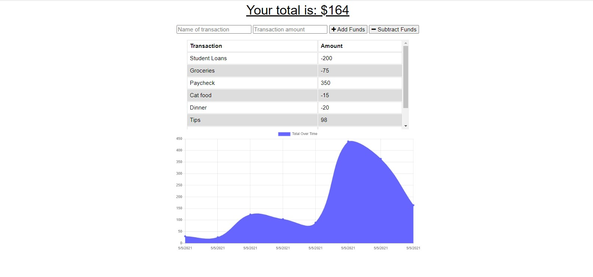

# Progressive Budget PWA 

## Description

An application that allows users to keep a running budget through an interactive user input feature that displays a graph view of the changing total.

## Usage
```
To use, type in the name of a transaction and the amount and choose the proper button to add or subtract from the total budget. The current total budget is listed boldly at the top. A running table of the transactions along with a bar graph depicting how those transactions effected the total budget is displayed below and dynamically updates as the user interacts with the page.
```
## Links

[repo](https://github.com/najuasaad/progressive-budget)

[heroku](https://calm-escarpment-52698.herokuapp.com/)

## Screenshot

